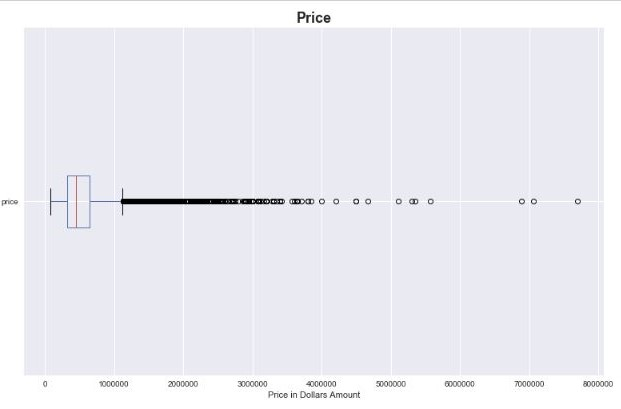
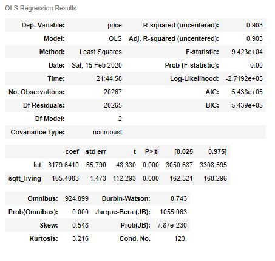

# Predicting Real Estate Prices
## King County Housing Dataset

## Goals and Overview

In this project, I was given a dataset containing real data about houses in King County. King County is the most populous county in Washington state with the seat of the county being Seattle.

Below is the information provided for each house in the dataset (21597 houses were in the dataset):

* **id** - unique identified for a house
* **dateDate** - house was sold
* **pricePrice** -  is prediction target
* **bedroomsNumber** -  of Bedrooms/House
* **bathroomsNumber** -  of bathrooms/bedrooms
* **sqft_livingsquare** -  footage of the home
* **sqft_lotsquare** -  footage of the lot
* **floorsTotal** -  floors (levels) in house
* **waterfront** - House which has a view to a waterfront
* **view** - Has been viewed
* **condition** - How good the condition is ( Overall )
* **grade** - overall grade given to the housing unit, based on King County grading system
* **sqft_above** - square footage of house apart from basement
* **sqft_basement** - square footage of the basement
* **yr_built** - Built Year
* **yr_renovated** - Year when house was renovated
* **zipcode** - zip
* **lat** - Latitude coordinate
* **long** - Longitude coordinate
* **sqft_living15** - The square footage of interior housing living space for the nearest 15 neighbors
* **sqft_lot15** - The square footage of the land lots of the nearest 15 neighbors

The goal of this project is to go through the 5 steps of a Data Scientist's Life cycle: OSEMN.

##### OSEMN:

Obtain - Gather Data from relevant resources 

Scrub - Clean data to formats that machine understands

Explore - Find significant patterns and trends using statistical methods

Model - Construct models to predict and forecast

Interpret - Put the results into good use

This process was to be applied on the King County dataset with the end result being the creation of a model that could predict the price of a house in King County.

------

# OBTAIN

The first step was the shortest. It involved importing the data and taking a first look at what was being worked with.

The columns that were included in the dataset are shown above, in Goals and Overview.

# SCRUB

Next the data needed to be cleaned. Cleaning in data science means fixing the problems with the data so that it can be better interpreted. The most common issues that need to be cleaned in a dataset are NaN or null values that are commonly found in a dataset. Along with NaNs, some values that don't make sense might be included. In this case, question marks were found in the sqft_basement column. One other very common problem is the presence of duplicates in the dataset. For the provided dataset, there multiples of the same house listed multiple times for each time it had been sold.

The way I dealt with these issues is I removed the duplicates, deciding the keep the latest selling of the house so that all my houses would be uniform in that way. I then inspected the individual value counts of each column and noticed that where there were NaNs, there were many zeroes and a few more would not hurt. I converted all NaN values to zero. I did the same thing with the question marks found in the sqft_basement column. 

I decided not to transform the data much more than this, because it was real data and I wanted my model to reflect reality.

# EXPLORE

Now, with the data cleaned, it was time to get more familiar with the data. In this section, I answered questions that I thought would be interesting about houses in King County.

## Question 1: Does renovation have a noticeable effect on price?

### Conclusion 1:

Renovating a house in King's County has a mean price increase of $237,423 or 144.0 percent.

## Question 2: Is there a difference in price between a house built in a given time period versus a house renovated in that same time period?

### Conclusion 2:

There seems to be a signficantly larger price to houses that were renovated in a time period compared to houses that were newly built in that same time period. It looks as if the gap in price is growing more and more for each time period until 2010-2015. This could be due to the fact that less time has passed compared to the other groupings of time.

## Question 3: Is there a difference in price based on geographical location in King's County?

For this question, I first heatmap of the houses using the latitude and longitude data in terms of price.

I then looked at the heatmap and thought it would be interesting to split the county into North and South at latitude 47.5 (roughly down the middle).

### Conclusion 3:

There is a tremendous difference (almost double, 90% difference) in pricing between Southern King County homes and Northern King County Homes. I also explored as to why that may be with other data provided, but could not find any meaningful conclusions other than the waterfront data provided seeming to have a lot of values missing. In this case it seems to be location, location, location.

## Further Exploration

### Multicollinearity

The model cannot have multicollinearity or intercorrelation of features. This means that related features (columns that aren't price) need to be removed before building the model. Making a heatmap with seaborn gave a good visualization of the correlations within the different columns as well as the correlation of each column to our target, price.

# MODEL

With more explanation and deductive reasoning, many of the original columns were removed and what seemed to be the best features were kept to build the model. When looking at how each category related to price, however, I kept noticing skewness due to outliers in price. I decided to take a look using a box plot which is great for detecting outliers.

As the plot shows, many outliers for expensive houses. I decided to remove everything past the upper whisker and found better relation between my features and price. I then tested my model. Here is the OLS Summary:

# INTERPRET

When running linear regression, certain assumptions need to be met:

1. LINEARITY: The relationship between the independent and dependent variables needs to be linear
2. NORMALITY: The linear regression analysis requires all variables to be normal.
3. MULTICOLLINEARITY: There is little to no multicollinearity in the data.
4. HOMOSCEDASTICITY: Residuals must be equal across the regression line.

My model did not meet any of these assumptions so there is a lot of room for improvement. Some things that were positive about my model were that all of the features I selected were significantly significant to determining price. The R-squared statistic also was close to 90% which makes my model a decent predictor for price. I had hoped to have more than 2 features by the end, but attempting to remove any multicollinearity posed to be a problem. Even with the last 2 remaining features, there was still some multicolinearity which can be observed by the large condition number in the OLS summary.